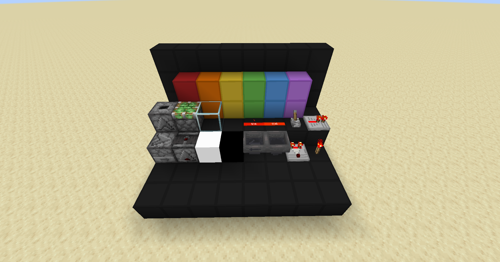

# JasperRed
A simple Minecraft redstone pack.

I did not create any of these textures, excluding the glass and lamps. This is an accumulation of multiple packs such as [VanillaTweaks](https://vanillatweaks.net/picker/resource-packs/) and [Codecrafted](https://codecrafted.net/)

## Features:
 * Actively Supported Versions: 1.20.2 (for now)
 * The Power Level of redstone dust is visible
 * Clean Wool & Glass
 * Clean Repeater and Comparater
 * Hopper, Observer, Dispenser, & Dropper Arrows
